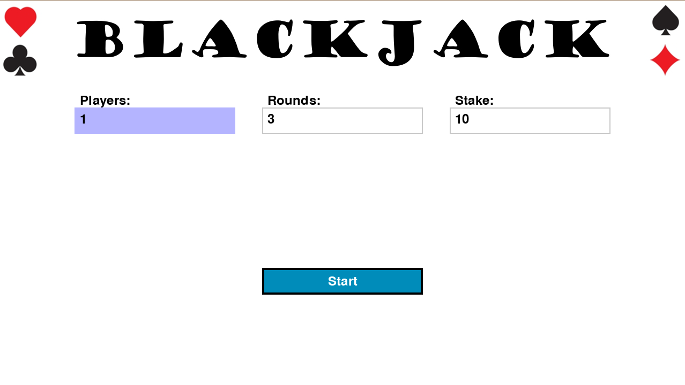
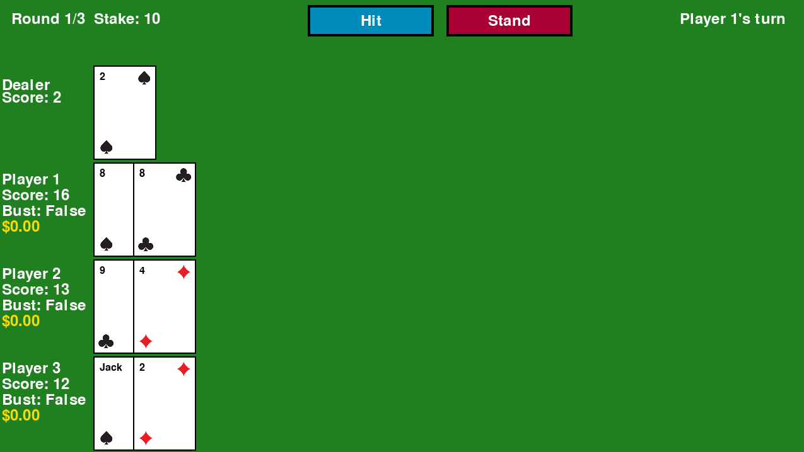
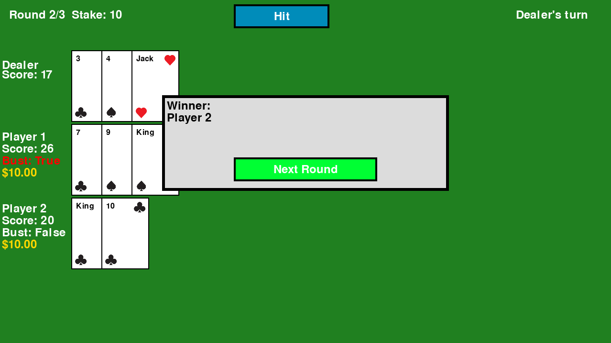
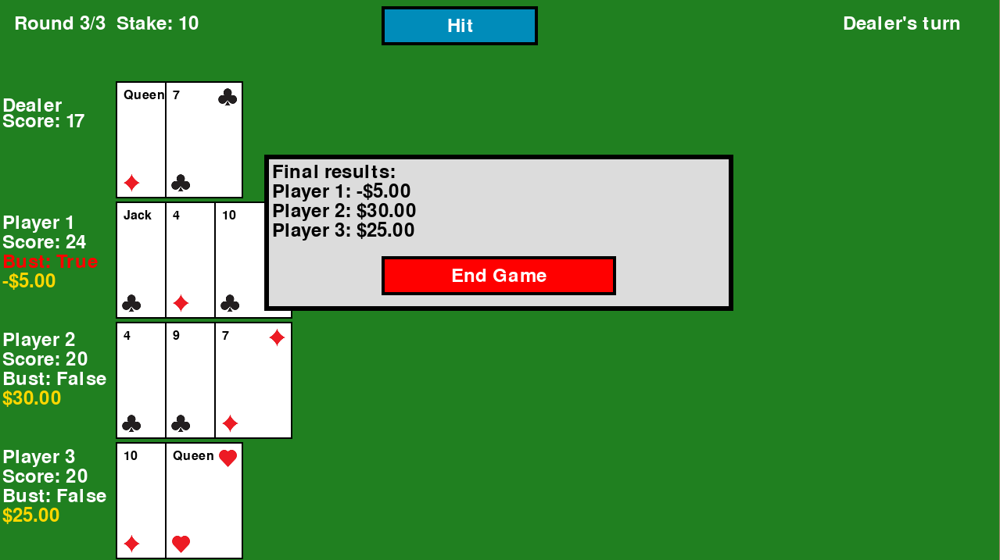

## Blackjack Tech Test
This repository is a recreation of blackjack cerated in Python made as my pre-assessment day task for the BBC Software Engineering Graduate Scheme 2025. The logic for the game was made in Python and the UI was created using [Pygame 2.6.1](https://www.pygame.org/news).

## Requirements
- Python version 3.11 available [here](https://www.python.org/downloads/release/python-3119/)

## Installation
1. Download the repository (SSH or HTTPS):
```bash
git clone git@github.com:Fokkos/blackjack.git
```
2. Navigate into the project directory:
```bash
cd blackjack
```
3. Install dependencies:
```bash
pip install -r .\requirements.txt
```

## Running the project
From the `blackjack` directory, the game can be played by running
```bash
python blackjack.py
```
Which will open a Pygame window with the game fully playable. From here you select the number of players, how many rounds to play and the stake for each round.

## Testing
This project was tested using the Python [unittest framework](https://docs.python.org/3/library/unittest.html), which tests the logic of the hands being dealt and scoring (as defined in the requirements document.
The tests can be run in the CLI from the root directory with
```bash
python -m unittest discover -s test -p "*.py"
```
Which will run all tests found in the `test` directory.
All specified features were tested for this project here besides the stand functionality, as that is done in the UI and has been thoroughly manually tested.

## Copyright
The images for the suits were created by tuyeproject and sourced from [vecteezy](https://www.vecteezy.com/vector-art/8573294-ace-card-suit-deck-ace-card-icon) using their Free License

## Screenshots
Below are screenshots of the game in action



